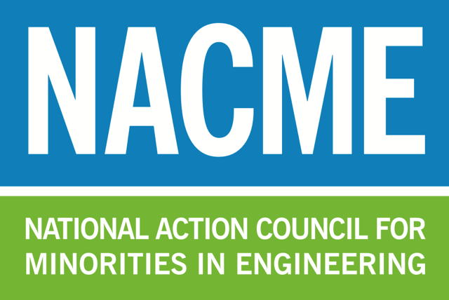
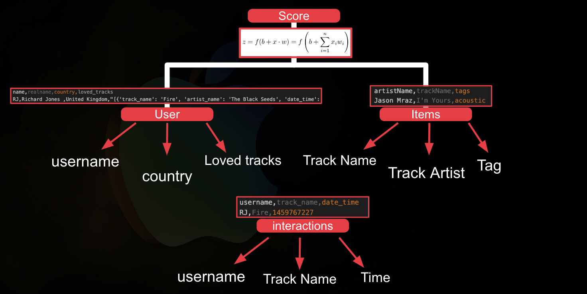
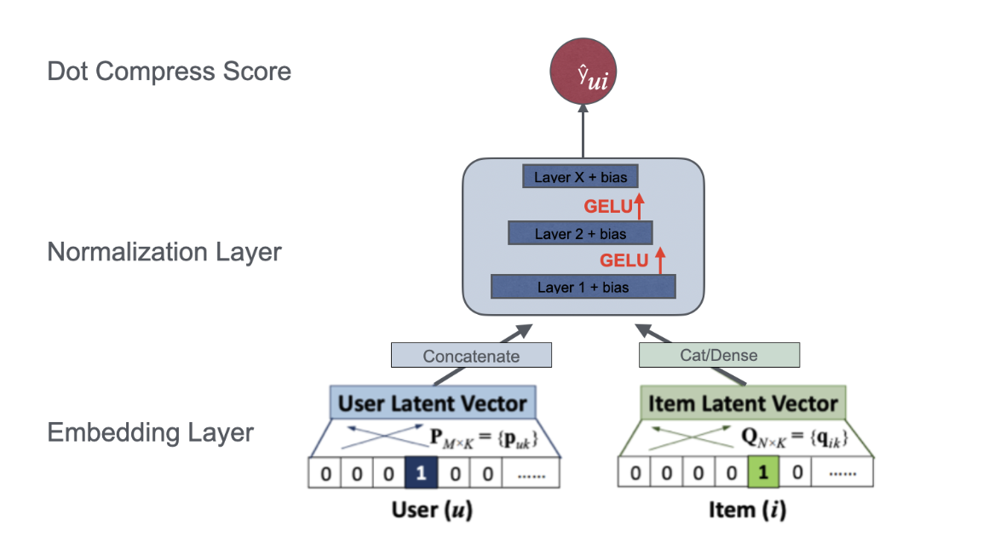

<!--
Name of your teams' final project
-->

# Music Recommendation System with Deep Learning
## [National Action Council for Minorities in Engineering(NACME)](https://www.nacme.org) Artificial Intelligence - Machine Learning (AIML) Intensive Summer Bootcamp at the [University of Southern California](https://viterbischool.usc.edu)

## Sponsors

<table style="border-collapse: collapse; text-align: center;">
  <tr>
    <td></td>
    <td></td>
    <td></td>
  </tr>
  <tr>
    <td>Apple</td>
    <td>NACME</td>
    <td>USC</td>
  </tr>
</table>

We would personally like to thank the Apple NACME AIML Bootcamp program directors, our professor Dr. Corey Baker, our guide Abdulla Alshabanah, our PI Murali Annavaram for giving us the opportunity to perform this research in an area that we are deeply interested in. Their support and guidance have been invaluable throughout the course of this project, and their dedication to fostering a learning environment has significantly contributed to our growth and development in the field of artificial intelligence and machine learning. Thank you for providing us with this incredible opportunity to explore and innovate.

<!--
List all of the members who developed the project and
link to each members respective GitHub profile
-->
Developed by: 
- [Alline Ayala](https://github.com/ayalaa04) - `Electronic Systems Engineering Technology` - `Texas A&M`
- [Noah Teckle](https://github.com/nteckle99) - `Electrical` - `University of Southern California` 
- [Jonathan Haile](https://github.com/jonathanhaile1) - `Computer Science and Business Administration` - `University of Southern California` 

## Description
In this project, the team developed a Two-Tower Collaborative Filtering Model to create a recommendation system for music. The team used Last.Fm's API and an Apple Music and Spotify dataset from Kaggle to perform the experiments. The model is a collaborative filtering model, which uses the interactions of all users determine which songs are interacted with and determine a score for the predicted song. 

## Model
The model works with the aid of a deep learning architecture. It makes use of an MLP and a SparseNN to make predictions on representations of user and item embeddings. If you're interested in viewing the code, we suggest you look at structs.py, and sparsenn.py. 

Below are diagrams showing the basic working of the two-tower MLP model:

Our model works along with a Sentence Transformer and user/item embeddings. The results of the model are found by running the main.py file with the appropriate command in step 11 or 15. The results will show a variety of scores. The Hit Rate (HR)@10 is the measure of the test item being in a user's top-k (top-10) list. The Normalized Discounted Cumulative Gain (NDCG)@10 is the metric based on the position of the true item among the top 10 list. This project used the following git repo of a recommendation system on MovieLens and BookCrossing as a reference: [repo](https://github.com/lkp411/BiasedUserHistorySynthesis)

## Further Research
With this code, we created our base model which uses song name as the essential embedded feature for recommendations. We experimented more with this code and used different item features to observe their results. The other features we worked with were:
1. Song Summaries for our Apple Music and Spotify Datasets provided by an LLM (Groq API)
2. Truncated Lyrics for both of the item Datasets, we will be using the first 25 truncated words of each song (Lyrics OVH API)

## Our Paper
Read our [paper](https://turquoise-carlynn-39.tiiny.site/):
<table align="center" style="background-color: white; border-collapse: collapse;">
  <tr>
    <td align="center" style="padding: 10px; border: none;">
      
    </td>
  </tr>
</table>

## Usage instructions
<!--
Give details on how to install fork and install your project. You can get all of the python dependencies for your project by typing `pip3 freeze requirements.txt` on the system that runs your project. Add the generated `requirements.txt` to this repo.
-->
NOTE: If you would like to access the completed data collection csv files as well as the Excel sheet with our data analysis, follow this [link](https://drive.google.com/drive/folders/1zmNw5xfLJT4QWMbdSXYyBXe1U2TYLTTI?usp=sharing)

1. Fork this repo
2. Change directories into your project
3. On the command line, type `pip3 install requirements.txt`
4. Create a .env file in the data_collection directory
5. Add the following line, with your Last Fm Api Key: LASTFM_API_KEY=YOUR_API_KEY
6. Add ".env" to .gitignore
7. pip install python-dotenv in your environment
8. Download [Apple Music Dataset](https://www.kaggle.com/datasets/kanchana1990/apple-music-dataset-10000-tracks-uncovered) into data_collection/DATASET
9. For Apple Music, run last_fm_user.py -> apple_items.py -> apple_rating.py -> apple_datareader.py
10. Change the dataset flag in main (lines 28 and 256) to 'apple_tracks'
11. Run the following command: TOKENIZERS_PARALLELISM=False python3 main.py --dataset=apple_tracks --dataset_dir=/PATH_TO_DATACOLLECTION/ --device=cpu --batch_size=1024 --print_freq=32 --lr=2e-5 --epochs=5 --margin=1 --num_negatives=20 --warm_threshold=0.2 --num_workers=8
12. Download [Spotify Dataset](https://www.kaggle.com/datasets/maharshipandya/-spotify-tracks-dataset) into data_collection/DATASET
13. For Spotify, run last_fm_user.py -> spotify_items.py -> spotify_rating.py -> spotify_data_reader.py
14. Change the dataset flag in main (lines 28 and 256) to 'spotify_tracks'
15. Run the following command: TOKENIZERS_PARALLELISM=False python3 main.py --dataset=spotify_tracks --dataset_dir=/PATH_TO_DATACOLLECTION/ --device=cpu --batch_size=1024 --print_freq=32 --lr=2e-5 --epochs=5 --margin=1 --num_negatives=20 --warm_threshold=0.2 --num_workers=8

## Sources
1. Play music, find songs, and discover artists. Last.fm. (n.d.).  
2. Groq is fast ai inference. Groq is Fast AI Inference. (n.d.-a).  
3. He, X., Liao, L., Zhang, H., Nie, L., Hu, X., & Chua, T.-S. (2017, Summer 26). Neural collaborative filtering. Neural Collaborative Filtering.  
4. Gossi, D., & Gunes, M. (n.d.). Lyric-based music recommendation - department of ... Lyric-Based Music Recommendation. 

